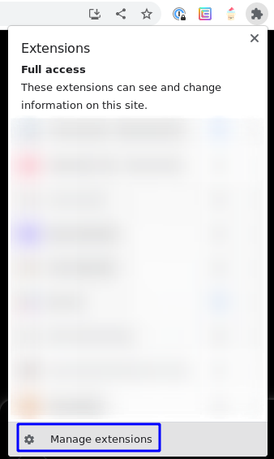
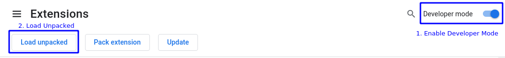
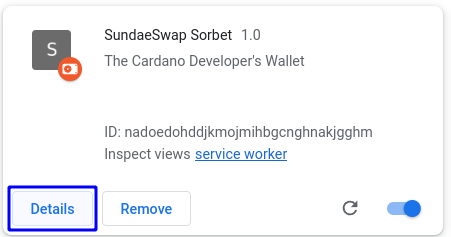
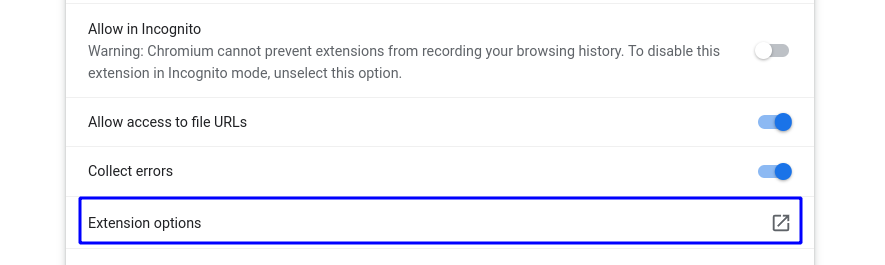
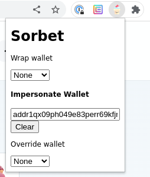
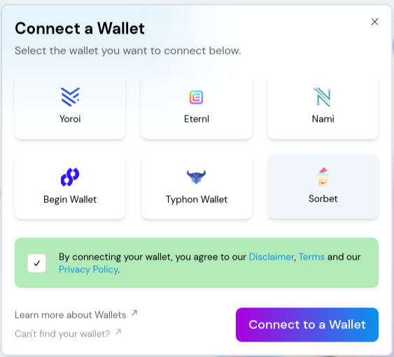

# Sorbet


The Cardano Developer's Wallet

## Roadmap
- [x] Impersonate an address, viewing the dApp (roughly) as that user would
- [x] Wrap a wallet, passing through functionality to an existing wallet
- [ ] Save common addresses in an address book
- [ ] Add the ability for sites to build Sorbet integrations
- [ ] CIP-45 capability
- [ ] Inspect traffic between a dApp and a wallet
- [ ] Return arbitrary data or errors to dApp requests, to test corner cases

## Installing

To install the extension, first build the the extension

```
$ yarn
$ yarn build
```

Then, from chrome or brave, click manage extensions:



Finally, enable developer mode, and click "Load Unpacked", navigating to the `dist` folder generated by yarn build.



To use the extension, first configure a blockfrost API key.

Click "Details" on the extension you loaded



and click "Extension Options"



from here, you can enter any configuration that the extension needs to operate.

## Use

Once configured, you can enter a wallet address to impersonate from the extension popup:



and it should appear as a CIP-30 wallet on the page:


